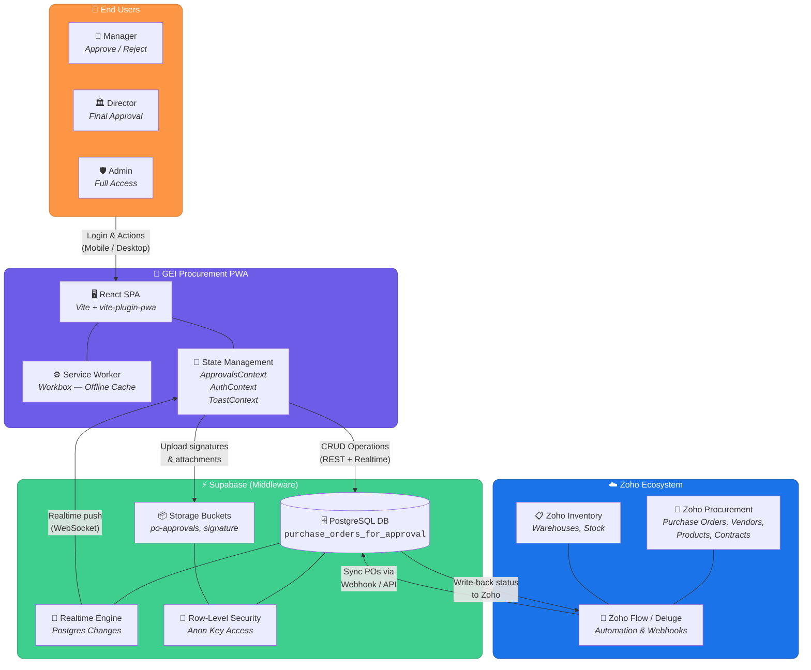
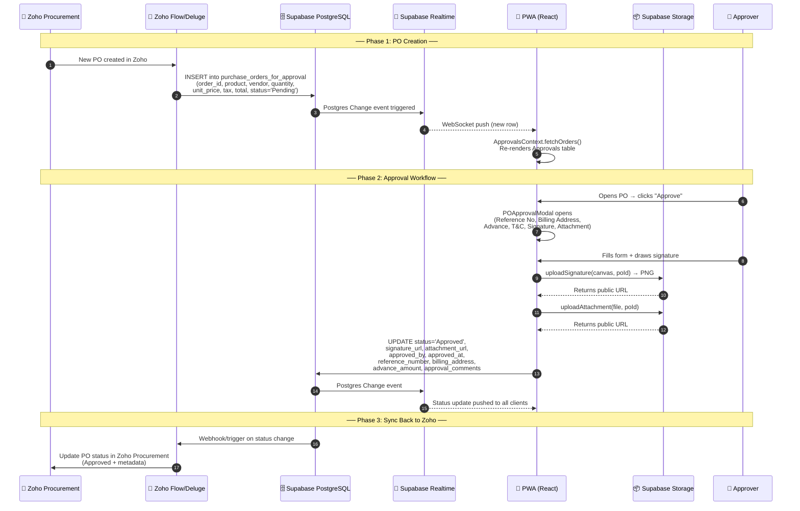
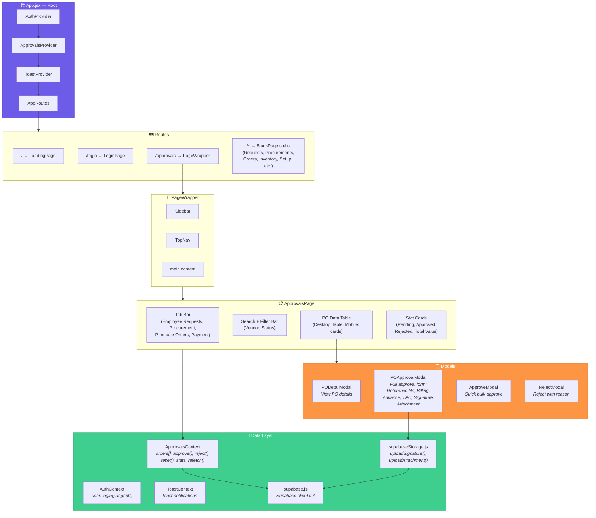
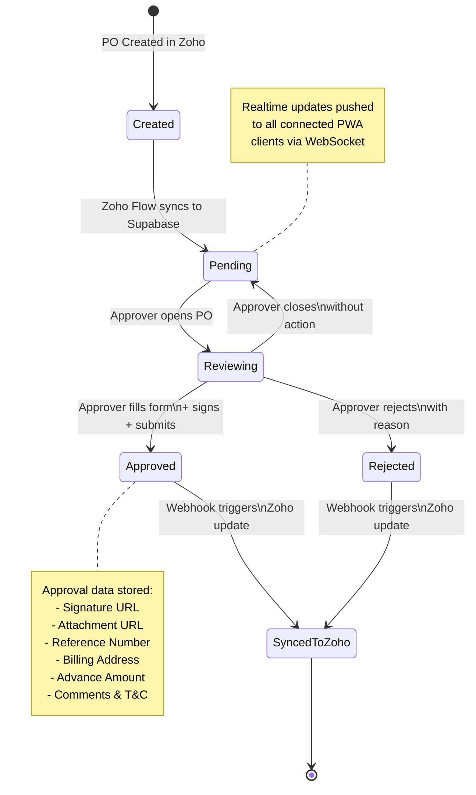

# GEI Procurement — System Architecture

## 1. High-Level System Overview

This diagram shows how **Zoho** (the enterprise source of truth) and your **PWA** (the mobile/web approval interface) communicate through **Supabase** as the middleware data layer.

---

## 2. Detailed Data Flow

This shows the exact sequence of data movement from Zoho → Supabase → PWA → back to Zoho when a Purchase Order is created and approved.

---

## 3. PWA Component Architecture

Shows the internal React component tree and how data flows through contexts.

---

## 4. Supabase Table Schema

The `purchase_orders_for_approval` table acts as the bridge between Zoho and the PWA:

| Column | Type | Source | Description |
|---|---|---|---|
| `id` | UUID | Supabase | Primary key (auto) |
| `order_id` | text | Zoho → Supabase | PO number from Zoho |
| `product` | text | Zoho → Supabase | Product name/description |
| `vendor` | text | Zoho → Supabase | Vendor name |
| `measurement_unit` | text | Zoho → Supabase | Unit (e.g., Pieces, KG) |
| `quantity` | numeric | Zoho → Supabase | Ordered quantity |
| `unit_price` | numeric | Zoho → Supabase | Price per unit |
| `tax_rate` | numeric | Zoho → Supabase | Tax percentage |
| `tax_amount` | numeric | Zoho → Supabase | Calculated tax |
| `discount_amount` | numeric | Zoho → Supabase | Discount applied |
| `shipping_charge` | numeric | Zoho → Supabase | Shipping cost |
| `total_cost` | numeric | Zoho → Supabase | Line total |
| `final_total` | numeric | Zoho → Supabase | Grand total |
| `type` | text | Zoho → Supabase | PO type |
| `terms_conditions` | text | Zoho → Supabase | Original T&C |
| `payment_terms` | text | Zoho → Supabase | Payment terms |
| `status` | text | **Both** | `Pending` → `Approved` / `Rejected` |
| `reference_number` | text | PWA → Supabase | Approver's reference |
| `billing_address` | text | PWA → Supabase | Selected billing entity |
| `advance_amount` | numeric | PWA → Supabase | Advance payment amount |
| `approval_comments` | text | PWA → Supabase | Approver comments |
| `approval_terms_conditions` | text | PWA → Supabase | Modified T&C by approver |
| `attachment_url` | text | PWA → Supabase | Uploaded file URL |
| `signature_url` | text | PWA → Supabase | Drawn signature image URL |
| `approved_by` | text | PWA → Supabase | Approver name |
| `approved_at` | timestamp | PWA → Supabase | Approval timestamp |
| `created_at` | timestamp | Supabase | Row creation time |
| `updated_at` | timestamp | Supabase | Last modified time |

---

## 5. PO Approval Workflow (State Machine)

---

## 6. Technology Stack Summary

| Layer | Technology | Role |
|---|---|---|
| **Enterprise Backend** | Zoho Procurement + Inventory | Source of truth for POs, vendors, products |
| **Automation** | Zoho Flow / Deluge Scripts | Bi-directional sync between Zoho ↔ Supabase |
| **Database** | Supabase PostgreSQL | Central data store for approval workflow |
| **Realtime** | Supabase Realtime (WebSocket) | Live push updates to all connected PWA clients |
| **File Storage** | Supabase Storage (buckets: `po-approvals`, `signature`) | Signatures & attachment files |
| **Frontend** | React 18 + Vite 5 | SPA with component-based UI |
| **PWA** | vite-plugin-pwa + Workbox | Offline capability, installable app, service worker caching |
| **Routing** | React Router v6 | Client-side navigation |
| **Icons** | Lucide React | UI iconography |
| **Auth** | Local auth (hardcoded users) | Role-based login (Admin, Manager, Director) |
